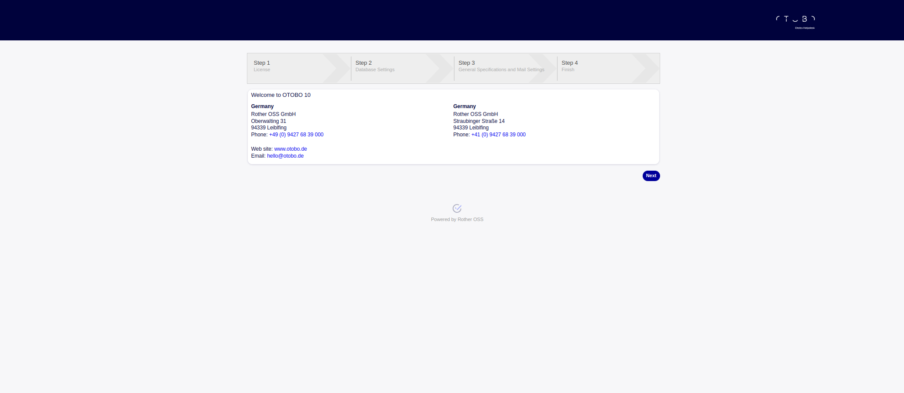
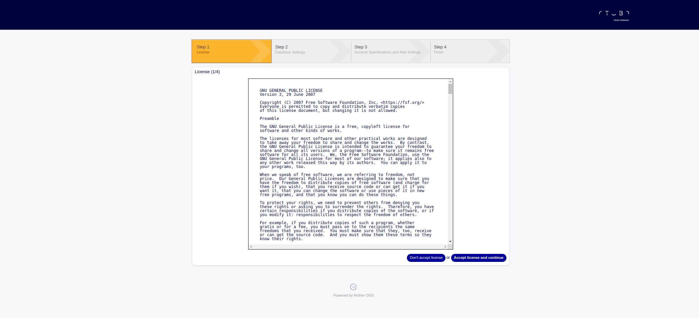
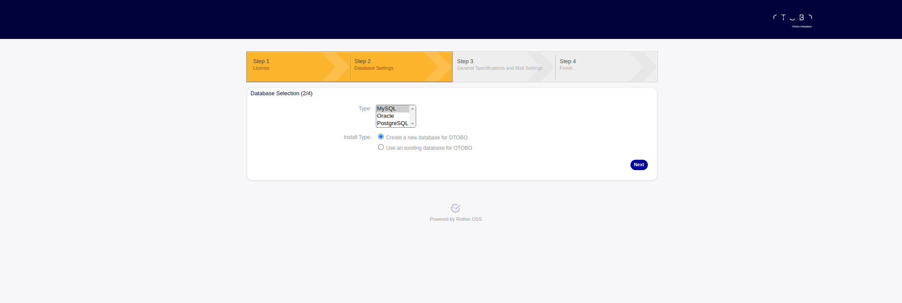
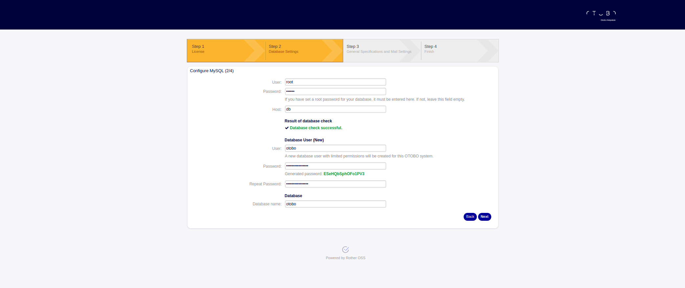
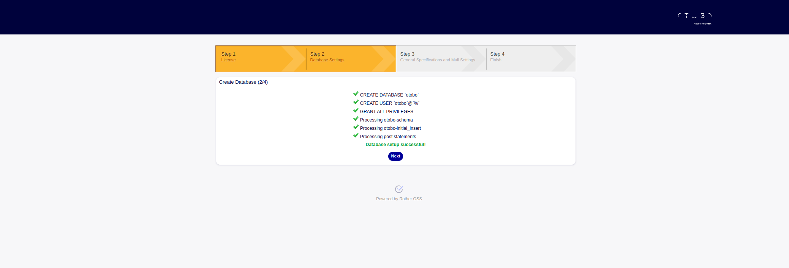
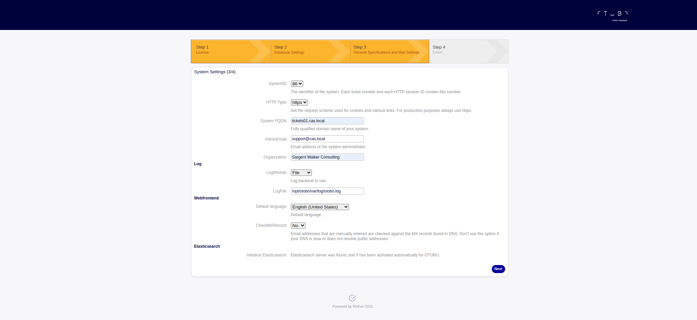
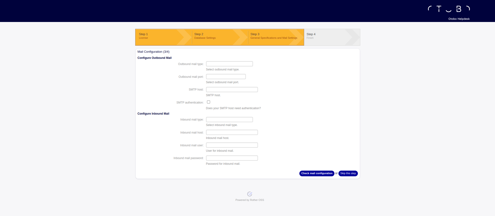
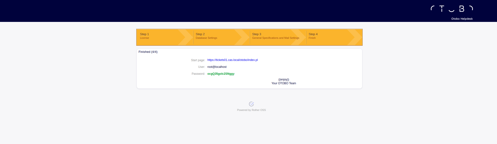
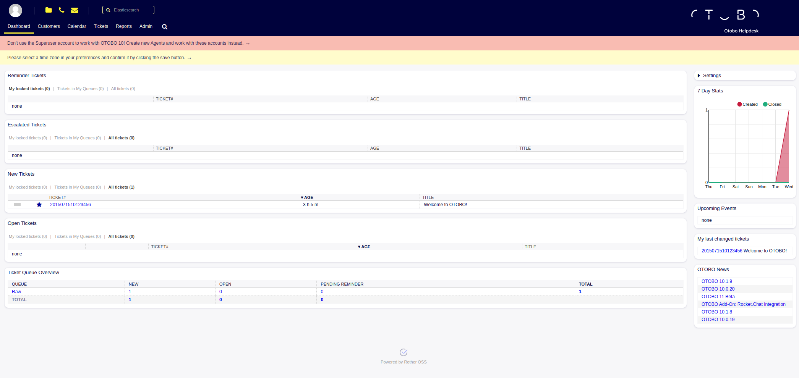

# Railhead Keycloak Project
This repository contains the code and configuration instructions to deploy RotherOSS's otobo, a fork of OTRS CE containers deployed from podman. For additional details, please email at [christopher.sargent@sargentwalker.io](mailto:christopher.sargent@sargentwalker.io).

# Prerequisites
* [Otobo](https://otobo.de/de/)
* [Otobo-docker](https://github.com/RotherOSS/otobo)
* [Otobo Instructions](https://doc.otobo.org/)
* [Otobo Installation](https://doc.otobo.org/manual/installation/10.1/en/content/index.html)
* [Otobo Ansible](https://github.com/bitfinity-nl/role-otobo)
* Take post set up snapshot on all servers 
* Create cas.local domain 

# Test VMs
* Note VM is running Ubuntu 20.04
* 172.18.0.22 tickets01.cas.local
* 10.1.2.189 dell01.cas.local

# Install Docker
1. ssh cas@172.18.0.22
2. sudo -i 
3. curl -fsSL https://get.docker.com -o install-docker.sh && sudo sh install-docker.sh

# Create Certificate and Key for SSL
1. cd /root 
2. mkdir -p /root/otobo-docker/docker-compose/otobo_nginx_ssl
3. openssl req -newkey rsa:2048 -nodes -keyout /root/otobo-docker/docker-compose/otobo_nginx_ssl/default.key -x509 -days 365 -out /root/otobo-docker/docker-compose/otobo_nginx_ssl/default.crt
```
Generating a RSA private key
**********************************************************************************************************************************************************************************************************************************************************+++++
***************************************************************************************+++++
writing new private key to 'key.pem'
-----
You are about to be asked to enter information that will be incorporated
into your certificate request.
What you are about to enter is what is called a Distinguished Name or a DN.
There are quite a few fields but you can leave some blank
For some fields there will be a default value,
If you enter '.', the field will be left blank.
-----
Country Name (2 letter code) [AU]:US
State or Province Name (full name) [Some-State]:Virginia
Locality Name (eg, city) []:Norfolk
Organization Name (eg, company) [Internet Widgits Pty Ltd]:SWC
Organizational Unit Name (eg, section) []:SWC
Common Name (e.g. server FQDN or YOUR name) []:tickets01.cas.local
Email Address []:christopher.sargent@sargentwalker.io
```
# Deploy Otobo 
1. ssh cas@172.18.0.22
2. sudo -i
3. cd /root
4. git clone https://github.com/RotherOSS/otobo-docker.git
4. git clone git@github.com:ChristopherSargent/railhead_otobo.git
5. cd otobo-docker/
6. cp .docker_compose_env_https .env
7. vim .env 
```
*
From
#OTOBO_NGINX_SSL_CERTIFICATE=/etc/nginx/ssl/ssl-cert.crt
#OTOBO_NGINX_SSL_CERTIFICATE_KEY=/etc/nginx/ssl/ssl-key.key
OTOBO_NGINX_SSL_CERTIFICATE=
OTOBO_NGINX_SSL_CERTIFICATE_KEY=

To

#OTOBO_NGINX_SSL_CERTIFICATE=/etc/nginx/ssl/ssl-cert.crt
#OTOBO_NGINX_SSL_CERTIFICATE_KEY=/etc/nginx/ssl/ssl-key.key
OTOBO_NGINX_SSL_CERTIFICATE=/etc/nginx/ssl/default.crt
OTOBO_NGINX_SSL_CERTIFICATE_KEY=/etc/nginx/ssl/default.key
```
```
# This file contains default values for environment values that are needed either by Docker Compose itself
# or by the docker compose files.

# COMPOSE_PROJECT_NAME declares the prefix of the name of the Docker containers, e.g. 'otobo_web_1'.
# It also declares the prefix of the name of named volumes. Thus changing the project name allows
# to switch easily between different incarnations of the containers. Note that when COMPOSE_PROJECT_NAME
# is set in the shell environment, then that setting has higher precedence.
COMPOSE_PROJECT_NAME=otobo
#COMPOSE_PROJECT_NAME=otovar_PROJECT

# COMPOSE_FILE is a collection of files, separated by COMPOSE_PATH_SEPARATOR, that make up the final config.
# The files usually reside in the subdirectory docker-compose.
# Additional services can be added by concatenating more files to COMPOSE_FILE. An example would services
# for S3 compatible storage. That is: :docker-compose/otobo-localstack.yml or :docker-compose/otobo-minio.yml
COMPOSE_PATH_SEPARATOR=:
COMPOSE_FILE=docker-compose/otobo-base.yml:docker-compose/otobo-override-https.yml

# Database configuration
# OTOBO_DB_ROOT_PASSWORD must be set
OTOBO_DB_ROOT_PASSWORD=123456

# Set this to a value in bytes to overwrite the default query size set for OTOBO
#OTOBO_DB_QUERY_CACHE_SIZE=

# HTTP options
# In the HTTPS case http:// redirects to https://
# Set OTOBO_WEB_HTTP_PORT when the HTTP port is not 80
#OTOBO_WEB_HTTP_PORT=<your special port>

# Set OTOBO_WEB_HTTP_IPADDR when only requests addressed to a specific IP should be served.
# See https://docs.docker.com/compose/compose-file/compose-file-v3/#ports
#OTOBO_WEB_HTTP_IPADDR=<your special ip address>

# HTTPS options

# set OTOBO_WEB_HTTPS_PORT when the HTTPS port is not 443
#OTOBO_WEB_HTTPS_PORT=<your special port>

# Set OTOBO_WEB_HTTPS_IPADDR when only requests addressed to a specific IP should be served.
# See https://docs.docker.com/compose/compose-file/compose-file-v3/#ports
#OTOBO_WEB_HTTPS_IPADDR=<your special ip address>

# The settings OTOBO_NGINX_SSL_CERTIFICATE and OTOBO_NGINX_SSL_CERTIFICATE_KEY
# are mandatory when HTTPS is used.
# The configured pathes must be absolute pathes that are available in the container.
#OTOBO_NGINX_SSL_CERTIFICATE=/etc/nginx/ssl/ssl-cert.crt
#OTOBO_NGINX_SSL_CERTIFICATE_KEY=/etc/nginx/ssl/ssl-key.key
OTOBO_NGINX_SSL_CERTIFICATE=/etc/nginx/ssl/default.crt
OTOBO_NGINX_SSL_CERTIFICATE_KEY=/etc/nginx/ssl/default.key


# Elasticsearch options
OTOBO_ELASTICSEARCH_ES_JAVA_OPTS=-Xms512m -Xmx512m

################################################################################
# The Docker image for the service 'db' can be specified explicitly.
# The default is mariadb:10.5
################################################################################
#OTOBO_IMAGE_DB=

################################################################################
# The Docker image for the services 'web' and 'daemon' can be specified explicitly.
# The default is rotheross/otobo:latest-10_1
################################################################################

# During development it is convenient to be able to switch between different Docker repositories and Docker image versions.
# The switching can be done with scripts/devel/generate_dot_env.sh. In order to activate this feature,
# create the file dot_env.m4 in your Docker Compose working dir, e.g. /opt/otobo-docker, and uncomment the line below.
#OTOBO_IMAGE_OTOBO=otovar_REPOSITORY()otobo:otovar_TAG()

# More examples
#OTOBO_IMAGE_OTOBO=rotheross/otobo:latest-10_1
#OTOBO_IMAGE_OTOBO=rotheross/otobo:rel-10_1_9
#OTOBO_IMAGE_OTOBO=rotheross/otobo:devel-rel-10_1
#OTOBO_IMAGE_OTOBO=otobo:local-10.1.x

################################################################################
# The Docker image for the service 'eleastic' can be specified explicitly.
# The default is rotheross/otobo-elasticsearch:latest-10_1
################################################################################

# During development it is convenient to be able to switch between different Docker repositories and Docker image versions.
# The switching can be done with scripts/devel/generate_dot_env.sh. In order to activate this feature,
# create the file dot_env.m4 in your Docker Compose working dir, e.g. /opt/otobo-docker, and uncomment the line below.
#OTOBO_IMAGE_OTOBO_ELASTICSEARCH=otovar_REPOSITORY()otobo-elasticsearch:otovar_TAG()

# More examples
#OTOBO_IMAGE_OTOBO_ELASTICSEARCH=rotheross/otobo-elasticsearch:latest-10_1
#OTOBO_IMAGE_OTOBO_ELASTICSEARCH=rotheross/otobo-elasticsearch:rel-10_1_9
#OTOBO_IMAGE_OTOBO_ELASTICSEARCH=rotheross/otobo-elasticsearch:devel-rel-10_1
#OTOBO_IMAGE_OTOBO_ELASTICSEARCH=otobo-elasticsearch:local-10.1.x

################################################################################
# The Docker image for the service 'redis' can be specified explicitly.
# The default is redis:6.0-alpine
################################################################################
#OTOBO_IMAGE_REDIS=

################################################################################
# The Docker image for the service 'nginx' can be specified explicitly.
# The default image is rotheross/otobo-nginx-webproxy:latest-10_1
################################################################################

# During development it is convenient to be able to switch between different Docker repositories and Docker image versions.
# The switching can be done with scripts/devel/generate_dot_env.sh. In order to activate this feature,
# create the file dot_env.m4 in your Docker Compose working dir, e.g. /opt/otobo-docker, and uncomment the line below.
#OTOBO_IMAGE_OTOBO_NGINX=otovar_REPOSITORY()otobo-nginx-webproxy:otovar_TAG()

# More examples
#OTOBO_IMAGE_OTOBO_NGINX=rotheross/otobo-nginx-webproxy:latest-10_1
#OTOBO_IMAGE_OTOBO_NGINX=rotheross/otobo-nginx-webproxy:rel-10_1_9
#OTOBO_IMAGE_OTOBO_NGINX=rotheross/otobo-nginx-webproxy:devel-rel-10_1
#OTOBO_IMAGE_OTOBO_NGINX=otobo-nginx-webproxy:local-10.1.x

```
8. cd docker-compose/
9. cp otobo-override-https.yml otobo-override-https.yml.ORIG
10. vim otobo-override-https.yml
```
# Run the OTOBO web app via HTTPS on the port $OTOBO_WEB_HTTPS_PORT or port 443 per default.
# HTTP on port 80 redirects to HTTPS on port 443.
# This is implemented by running nginx as a reverse proxy for a webserver running otobo.psgi.

# See also README.md.

# most current docker-compose file version, as of 2020-05-21
version: '3.3'

services:

  # There is no HTTP port is specified, as the otobo webserver should only be reachable via HTTPS.
  # Note that the nginx service does provide service to port 80, but only to redirect to HTTPS.
  #web:
  #  ports:
  #    - "${OTOBO_WEB_HTTP_IPADDR:-0.0.0.0}:${OTOBO_WEB_HTTP_PORT:-80}:5000"

  nginx:
    image: ${OTOBO_IMAGE_OTOBO_NGINX:-rotheross/otobo-nginx-webproxy:latest-10_1}
    # according to https://stackoverflow.com/questions/43467670/which-capabilities-can-i-drop-in-a-docker-nginx-container
    cap_drop:
        - ALL
    cap_add:
        - CAP_SYS_CHROOT
        - CAP_CHOWN
        - CAP_DAC_OVERRIDE
        - CAP_SETGID
        - CAP_SETUID
    depends_on:
      - web
    restart: always
    volumes:
#    - ./otobo_nginx_ssl:/etc/nginx/ssl
#      - ./otobo_nginx_ssl/ssl-cert.crt:/etc/nginx/ssl/ssl-cert.crt
#      - ./otobo_nginx_ssl/ssl-key.key:/etc/nginx/ssl/ssl-key.key
      - ./otobo_nginx_ssl/default.crt:/etc/nginx/ssl/default.crt
      - ./otobo_nginx_ssl/default.key:/etc/nginx/ssl/default.key

    # The HTTP port is exposed, but only redirects to HTTPS
    ports:
      - "${OTOBO_WEB_HTTPS_IPADDR:-0.0.0.0}:${OTOBO_WEB_HTTPS_PORT:-443}:8443"
      - "${OTOBO_WEB_HTTP_IPADDR:-0.0.0.0}:${OTOBO_WEB_HTTP_PORT:-80}:8080"
    # inside the docker network the host and the port is fixed
    environment:
      OTOBO_NGINX_WEB_HOST: web
      OTOBO_NGINX_WEB_PORT: 5000
      OTOBO_WEB_HTTPS_PORT: ${OTOBO_WEB_HTTPS_PORT:-}
      OTOBO_NGINX_SSL_CERTIFICATE: ${OTOBO_NGINX_SSL_CERTIFICATE:?err}
      OTOBO_NGINX_SSL_CERTIFICATE_KEY: ${OTOBO_NGINX_SSL_CERTIFICATE_KEY:?err}
      NGINX_ENVSUBST_TEMPLATE_DIR: ${NGINX_ENVSUBST_TEMPLATE_DIR:-}
    healthcheck:
      test: service nginx status || exit 1

volumes:
  otobo_nginx_ssl:
    external: true
```
11. cd /root/otobo-docker
12. docker compose up -d
13. https://tickets01.cas.local/otobo/installer.pl
* otobo  ESeHQbSphOFo1PV3 database

















14. https://tickets01.cas.local/otobo/index.pl
* Start page: https://tickets01.cas.local/otobo/index.pl User:root@localhost Password:ocgQ35golc2SNggy





